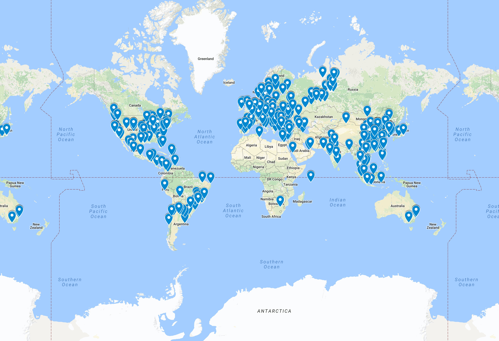

# HoneyResult

Tras instalar un honeypot en la red y dejandolo funcionar durante 12 horas, ha recibido 27.936 intentos de entrada.

Una vez obtenida las ip, generé el siguiente script para obtener la informacion de cada una de las ips:

		<?php 

		function analize($file){
			$token ="add token here";
			$handle = fopen($file, "r");
			if ($handle) {
			    while (($line = fgets($handle)) !== false) {
			        //echo "$line";

			        $curl = curl_init();
					curl_setopt_array($curl, array(
			    		CURLOPT_RETURNTRANSFER => 1,
			    		CURLOPT_URL => "http://ipinfo.io/$line/json?token=$token",
					));
					$result = curl_exec($curl);

					if (curl_errno($curl)){ 
		   				echo "Ha ocurrido un error con curl", PHP_EOL;
					}else{
						//echo $result;
						$json = $result;
						$json = json_decode($json, true);
						echo $json['ip'],";";
						echo $json['city'],";";
						echo $json['region'],";";
						echo $json['country'],";";
						echo $json['loc'],PHP_EOL;;

					}

					curl_close($curl);

			    }

			    fclose($handle);
			    echo PHP_EOL;
			} else {
		    	echo "Error al obtener el manejador", PHP_EOL;
			} 
		}

		if(isset($argv[1])){
			analize($argv[1]);
		}else{
			echo "Debes aniadir el fichero a leer", PHP_EOL;
		}

		?>

Ejecute una muestra aleatoria de 1000 resultados, redirigiendo la salida del script y procesando cada uno de los json obtuvimos el siguiente mapa:

El mapa se puede visitar en este [enlace](https://drive.google.com/open?id=1x3u8aQ7zDJLjcv6KsoDhqRmmMNs&usp=sharing)

* [Tabla de  1000](tabla.md)
* [Conjunto global de ips](ip.md)